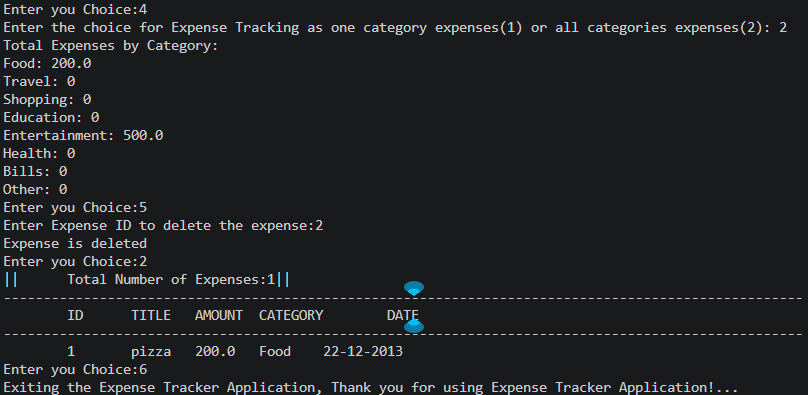

# Expense Tracker Application

A simple command-line based Expense Tracker Application built using Python.

This project was created as part of a Python Internship project to practice:
- Python fundamentals
- Functions
- Lists and Dictionaries
- Expense Calculations
- CRUD Operations
- User Interaction
- Basic Documentation

---

# Project File

```bash
project2-expense-tracker.py
```

---

# Features Implemented

1. Add New Expenses  
2. View All Expenses  
3. Calculate Total Expenses  
4. Track Expenses by Category  
5. Delete Expenses  
6. Auto Increment Expense ID  
7. Category-wise Expense Tracking  
8. Table Format Expense Display  

---

# Technologies Used

- Python
- Lists
- Dictionaries
- Loops
- Conditional Statements
- Functions
- String Formatting

---

# How the Program Works

The application stores all expenses inside a Python List.

Each expense is stored as a Dictionary containing:

- Expense ID
- Title
- Amount
- Category
- Date

The user interacts with the application using a menu-driven interface.

---

# Menu Options

```text
1. Add Expense
2. View Expenses
3. Show Total Expense
4. Show Total Expense by Category
5. Delete Expense
6. Exit
```

---

# Functions Implemented

## add_expense()

Adds a new expense with:
- Title
- Amount
- Category
- Date

Each new expense gets:
- Automatic Expense ID

---

## view_expense()

Displays:
- Total Number of Expenses
- All expenses in table format

---

## total_expense()

Calculates and displays:
- Total amount spent by the user

---

## show_total_expense_by_category()

Tracks expenses category-wise.

User can:
- View total expense for one category
- View total expenses for all categories

Categories implemented:
- Food
- Travel
- Shopping
- Education
- Entertainment
- Health
- Bills
- Other

---

## delete_expense()

Deletes an expense using Expense ID.

---

# Expense Structure

Example of how expense data is stored:

```python
{
    "id": 1,
    "title": "Lunch",
    "amount": 250,
    "category": "Food",
    "date": "22-05-2026"
}
```

---

# Sample Output

## Expense Statistics

```text
|| Total Number of Expenses:2 ||
```

---

## Table Format Output

```text
------------------------------------------------------------------------------------------
ID      TITLE           AMOUNT          CATEGORY            DATE
------------------------------------------------------------------------------------------
1       Lunch           250             Food                22-05-2026
2       Movie           500             Entertainment       23-05-2026
------------------------------------------------------------------------------------------
```

---

# Screenshots (Output)


---




# How to Run the Program

## Step 1

Install Python on your system.

Download from:

https://www.python.org/

---

## Step 2

Open terminal or command prompt.

---

## Step 3

Navigate to the project folder.

Example:

```bash
cd Project2
```

---

## Step 4

Run the program.

```bash
python project2-expense-tracker.py
```

---

# Concepts Practiced

This project helped practice:

- CRUD Operations
- Expense Calculations
- List Operations
- Dictionary Handling
- Function Design
- Loop Traversal
- User Input Handling
- Category-based Tracking
- Table Formatting

---

# Author

Created as part of DecodeLabs Python Internship.
